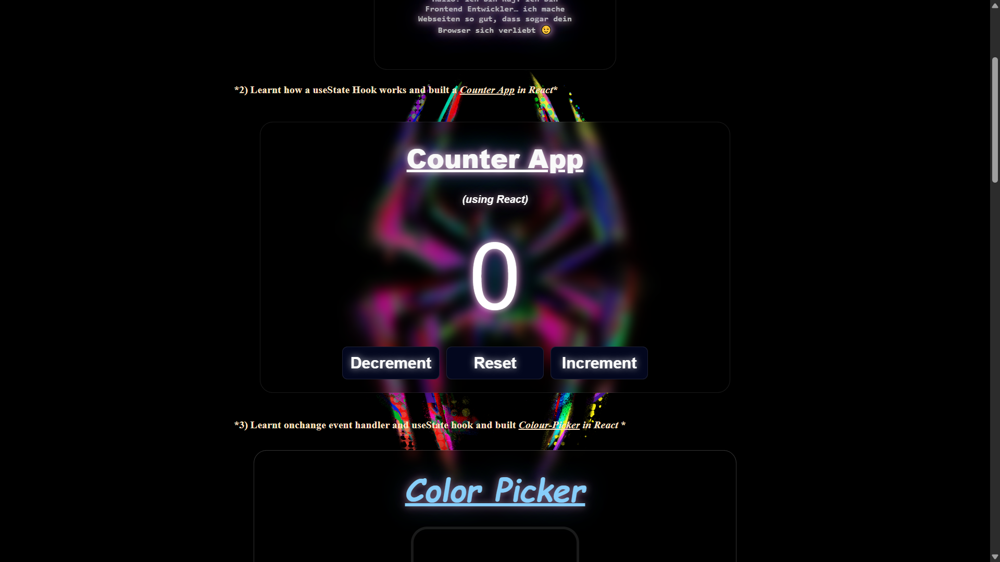
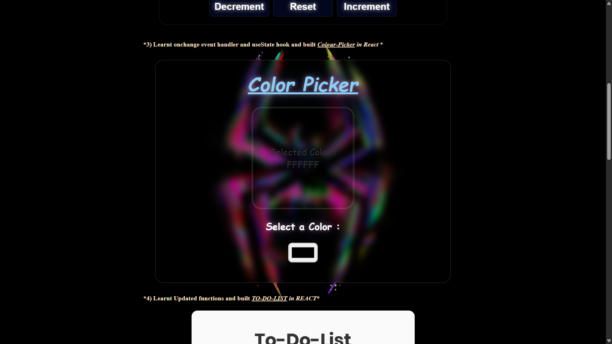
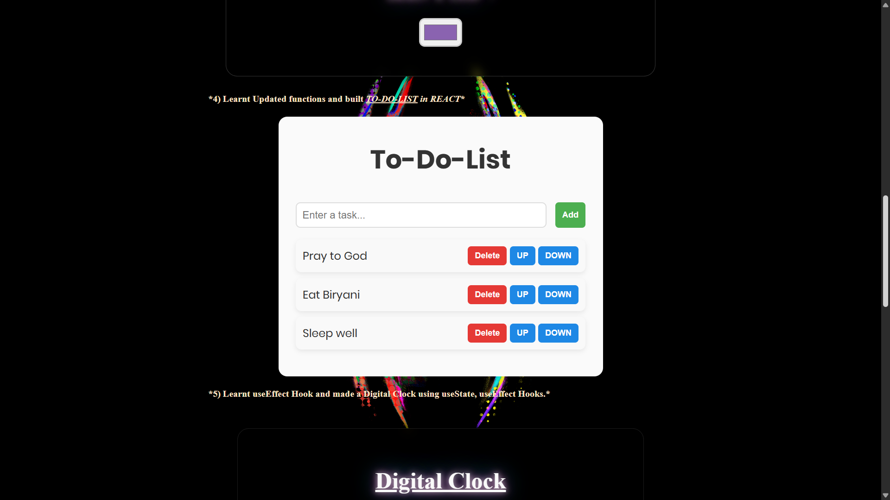
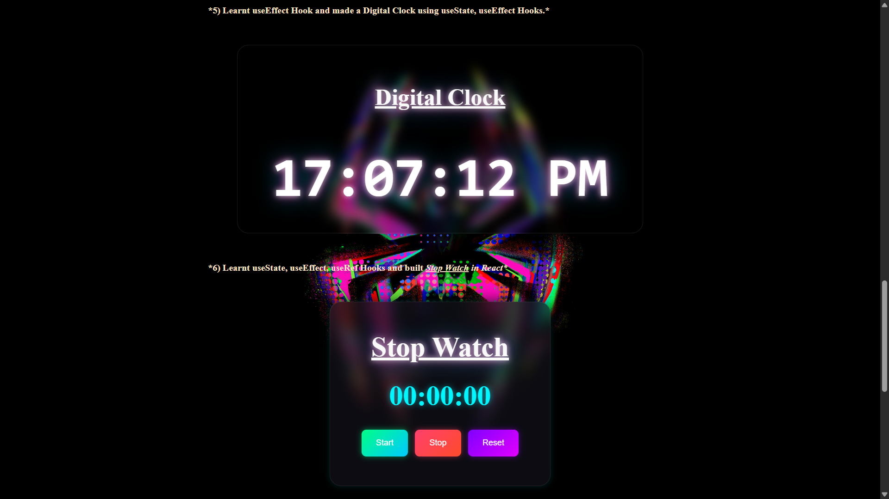
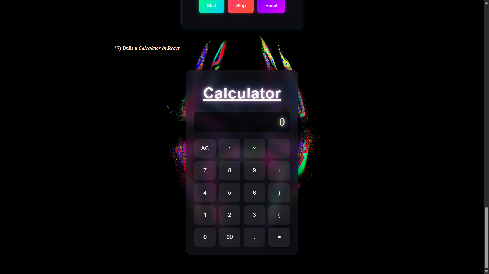
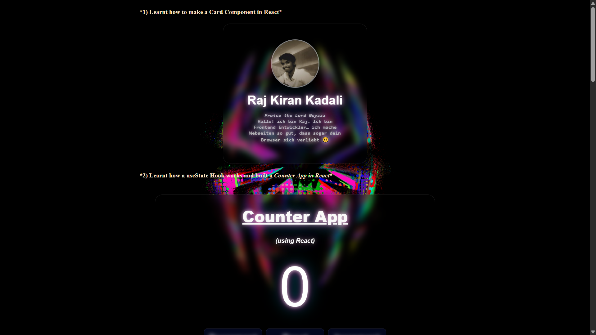

# React Mini Projects
Learnt the fundamentals and Core concepts of React JS and made 7 Mini projects to gain hands-on experence on React JS
This repository contains 7 mini projects built while learning React.js.

## Projects Included
- Card Component
- Counter App
- Color Picker
- To-Do List
- Digital Clock
- Stop Watch
- Calculator

## Concepts Covered
- Component-based architecture
- useState Hook
- useEffect Hook
- useRef Hook
- Event handling
- Dynamic UI updates

## Tech Stack
- React.js
- JavaScript (ES6)
- CSS (Glassmorphism + Neon UI)

## Live Demo
https://react-7-mini-projects.netlify.app/

## Acknowledgment

This project was built as part of my React.js learning journey, inspired by tutorials from Bro Code.

🔗 Channel Link : https://www.youtube.com/@BroCodez
🔗 Video Link : https://youtu.be/CgkZ7MvWUAA?si=JJFBmfJSTahtNc5C 

## Project Screenshots

### Counter App

### Color Picker

### To-Do List

### Digital Clock and Stop Watch

### Calculator

### Card Component

---
 More projects coming soon...
